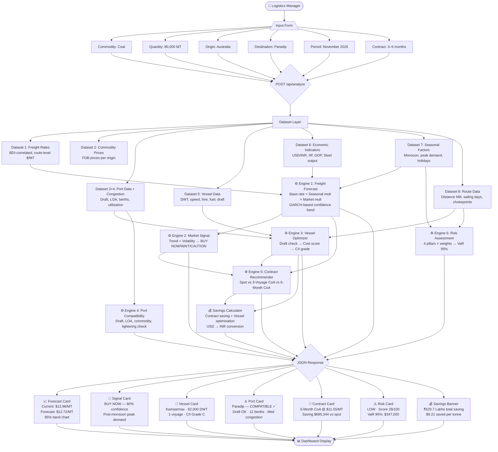

# FreightIQ — SIH26006 System Flowchart

## Complete MVP Workflow



## Architecture Diagram

```
┌─────────────────────────────────────────────────────────────┐
│                    FRONTEND (React + Vite)                   │
│  ┌──────────────┐   ┌──────────────────────────────────────┐ │
│  │  InputForm   │   │           ResultsPanel               │ │
│  │              │   │  ┌──────────┐  ┌──────────┐          │ │
│  │  Commodity   │──▶│  │Forecast  │  │ Signal   │          │ │
│  │  Quantity    │   │  │  Card    │  │  Card    │          │ │
│  │  Origin      │   │  ├──────────┤  ├──────────┤          │ │
│  │  Port        │   │  │ Vessel   │  │  Port    │          │ │
│  │  Period      │   │  │  Card    │  │  Card    │          │ │
│  │  Contract    │   │  ├──────────┤  ├──────────┤          │ │
│  └──────────────┘   │  │Contract  │  │  Risk    │          │ │
│                     │  │  Card    │  │  Card    │          │ │
│                     │  └──────────┴──┴──────────┘          │ │
│                     │  ┌────────────────────────┐           │ │
│                     │  │     Savings Banner     │           │ │
│                     │  └────────────────────────┘           │ │
│                     └──────────────────────────────────────┘ │
└───────────────────────────────┬─────────────────────────────┘
                                │ POST /api/analyze
┌───────────────────────────────▼─────────────────────────────┐
│                 BACKEND (FastAPI + Python)                    │
│                                                              │
│  ┌─────────────┐   ┌──────────────────────────────────────┐ │
│  │ Dataset     │   │         analyze_engine.py            │ │
│  │ Layer       │   │                                      │ │
│  │             │──▶│  _forecast_freight()   → rates       │ │
│  │ Freight     │   │  _market_signal()      → BUY/WAIT   │ │
│  │ Rates       │   │  _recommend_vessel()   → Kamsarmax  │ │
│  │ Ports       │   │  _port_compatibility() → COMPATIBLE │ │
│  │ Vessels     │   │  _contract_rec()       → 6M CoA     │ │
│  │ Economic    │   │  _risk_assessment()    → LOW        │ │
│  │ Seasonal    │   │  _savings_opportunity()→ ₹620L      │ │
│  │ Routes      │   │                                      │ │
│  └─────────────┘   └──────────────────────────────────────┘ │
└─────────────────────────────────────────────────────────────┘
```

## Data Flow for MVP Example

| Input | Value |
|-------|-------|
| Commodity | Thermal Coal |
| Quantity | 80,000 MT |
| Origin | Australia |
| Destination | Paradip |
| Period | November 2026 |
| Contract | 6 months |

| Output | Result |
|--------|--------|
| 📈 Freight Forecast | $12.98/MT current → $12.72/MT Nov 2026 |
| 🎯 Market Signal | **BUY NOW** (80% confidence) |
| 🚢 Vessel | **Kamsarmax** 82,000 DWT · 1 voyage · CII-C |
| ⚓ Port Compat. | **COMPATIBLE** · Draft 13.8m ≤ 17.0m |
| 📄 Contract | **6-Month CoA** @ $11.55/MT (-11% vs spot) |
| ⚠️ Risk | **LOW** · Score 28/100 |
| 💰 Savings | **₹620.7 Lakhs** ($737,152 USD) |
